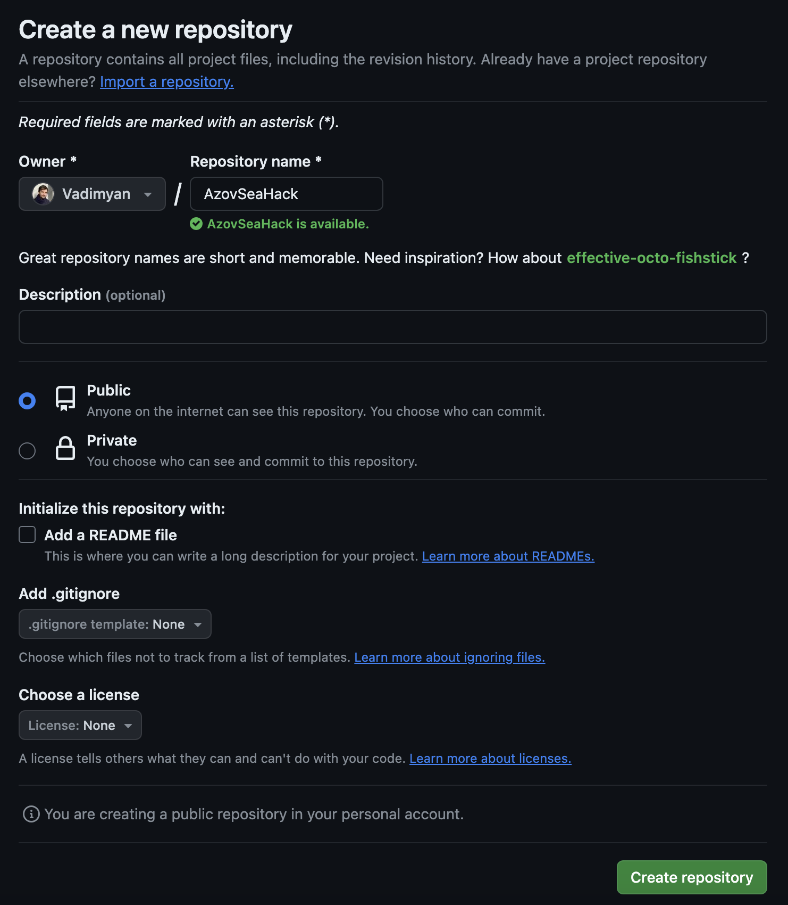
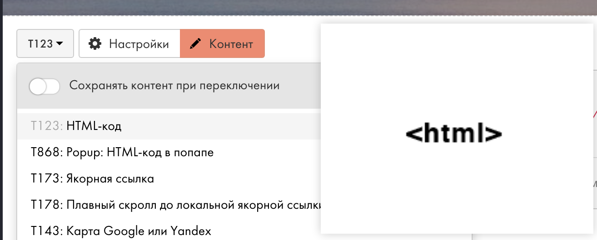

# AzovSeaDemo

Туториал по использованию Яндекс Карт для визуализации данных.

С чем можно познакомиться за время прохождения туториала:
1. API Яндекс Карт для визуализации точек из датасетов.
2. Запуск python-скриптов через браузер в replit.
3. Хостинг сайтов на GitHub.
4. Онлайн IDE Codespaces.
5. Сайты на tilda и интеграция блоков в них.

## Учимся работать с Яндекс Картами

Вначале нужно получить ключ от API чтобы пользоваться Картами на сайте.

1. Заходи на сайт для разработчиков [https://developer.tech.yandex.ru](https://developer.tech.yandex.ru)

2. Если нужно авторизируйся / регистрируйся.

3.  Кнопка "Подключить API" -> "JavaScript API и HTTP Геокодер"


4. Получаем и копируем новый ключ.

Теперь создавай простую страницу, которая будет отображать объект на карте. В любом редакторе.

<details>
  <summary>index.html</summary>
  
  ```html
<!DOCTYPE html>
<html>
<head>
    <title>Отображение рыбы на карте</title>
    <script src="https://api-maps.yandex.ru/2.1/?apikey=ваш_api_ключ&lang=ru_RU" type="text/javascript"></script>
    <style>
        #map {
            width: 600px; 
            height: 400px; 
        }
    </style>
</head>
<body>
<div id="map"></div>
<script>
ymaps.ready(init);

function init() {
    var myMap = new ymaps.Map("map", {
        center: [46.36, 37.21], // Координаты центра карты
        zoom: 5
    });

    // Пример данных из датасета
    var data = [
        {"lat": 46.3625, "long": 37.1955, "name": "Карась"},
    ];

    // Для каждой точки рисуем с помощью API Placemark и ставим на карту
    data.forEach(function(item) {
        var placemark = new ymaps.Placemark([item.lat, item.long], {
            balloonContent: item.name
        });

        myMap.geoObjects.add(placemark);
    });
}
</script>
</body>
</html>
  ```
  
</details>

Теперь открывай страницу в любом браузере. Должно получиться примерно так:


Хорошо, но мелковато. Можно поиграться с настройками карты, например, сделать `zoom: 7`.


Теперь в самый раз.

## Учимся загружать файлы с датасетом на карту.

Если датасет состоит из координат и имени точки (так было в предыдущем примере):

```json
[
    { "lat": 46.58502, "long": 37.63368, "name": "Белуга" },
    { "lat": 46.7126, "long": 37.21699, "name": "Карп" },
    ...
]
```

то можно, например, заменить данные в коде на загрузку файла — так ты сможешь сделать несколько датасетов и быстро продемонстрировать их кому-нибудь.

<details>
    <summary>Кстати, я сформировал тестовый датасет для этого дема с помощью python</summary>

```python
# Сгенерируем примерный датасет с координатами в районе Азовского моря и названиями рыб для 50-60 записей.

import random
import json

# Некоторые обитающие в Азовском море рыбы
fish_names = [
    "Карась", "Щука", "Судак", "Лещ", "Карп", "Плотва", "Окунь", "Сом", "Белуга", "Осетр",
    "Сельдь азовская", "Тюлька", "Камбала", "Морской черт", "Минога", "Севрюга"
]

# Координаты Азовского моря
lat_range = (45.5, 46.5)  # Широта
long_range = (35.5, 37.5)  # Долгота

dataset = [
    {
        "lat": round(random.uniform(*lat_range), 5),
        "long": round(random.uniform(*long_range), 5),
        "name": random.choice(fish_names)
    }
    for _ in range(55)  # Генерируем 55 записей
]

print(json.dumps(dataset, ensure_ascii=False, indent=4))
```

А ещё кто угодно может скопировать, изменить и запустить этот скрипт прямо в браузере с помощью [repl.it](https://replit.com/@VadimMartynov/AzovSeaDemo#main.py)
</details>


Чтобы загружать данные на Карты из файла понадобится пара изменений.

Во-первых, добавить элемент выбора файла на страницу:

```html
<input type="file" id="file-input" />
```

Во-вторых, вместо массива с записями использовать данные из файла. Для этого нужно подписаться на событие `change` элемента `file-input`, прочитать файл, распарсить json и использовать полученную коллекцию. Меняй код формирования точек на карте в index.html на такой:

```html
document.getElementById('file-input').addEventListener('change', function(event) {
    var file = event.target.files[0];
    if (file) {
        var reader = new FileReader();
        reader.onload = function(e) {
            var data = JSON.parse(e.target.result);
            data.forEach(function(item) {
                var placemark = new ymaps.Placemark([item.lat, item.long], {
                    balloonContent: item.name
                });
                myMap.geoObjects.add(placemark);
            });
        };
        reader.readAsText(file);
    }
});
```

и проверяй результат. Должно получиться примерно так:


## Хостим файлы в интернете

Всё это выглядит интересно, но нам нужно где-то расположить наш датасет, уметь его редактировать, а ещё опубликовать карту чтобы она была доступна по ссылке.

На самом деле здесь есть много разных способов, но один из самых быстрых — это GitHub Pages. Это такая штука, которая позволяет опубликовать репозиторий github по определенному адресу так будто это сайт на хостинге. Кстати, сейчас мы именно в таком репозитории.

Что нужно будет сделать.

1. Заходи на [github.com](github.com), если надо — регистрируйся или аутентифицируйся.

2. Создавай новый репозиторий.


3. Заполни название (будет частью пути). Больше ничего можно не настраивать, жми "Create repository"



4. В новом репозитории нужно включить Pages. Для этого переходи в Settings, потом на страницу Pages, там нужно включить Pages, выставить публикацию из бранча, выбрать main-бранч и корневую директорию для сайта:


Собственно, это всё. Но теперь нужно добавить в репозиторий страницу. И, возможно, сразу подключить датасет из файла. Это можно сделать, не скачивая репозторий и без установленной IDE. Вот порядок действий, который открывает Github codespaces — веб-редактор кода с поддержкой git.


Теперь в репозиторий создай dataset.json с своим датасетом (или с тем, что сгенерируешь скриптом для тестирования) и index.html. Чтобы данные на карте брались из файла в репозитории нужно изменить index.html (ещё в новом файле карта отображается на весь экран):

<details>
    <summary>index.html</summary>

```html
<!DOCTYPE html>
<html>
<head>
    <title>Отображение данных на Яндекс.Картах</title>
    <script src="https://api-maps.yandex.ru/2.1/?apikey=809a3df5-be37-4e68-a55a-6e6e88269e10&lang=ru_RU" type="text/javascript"></script>
    <style>
        html, body {
            height: 100%;
            margin: 0;
            padding: 0;
        }
        #map {
            height: 100%;
            width: 100%;
        }
    </style>
</head>
<body>
<div id="map"></div>
<script>
ymaps.ready(init);

function init() {
    var myMap = new ymaps.Map("map", {
        center: [46.48678, 36.82593], // Центр карты
        zoom: 10
    });

    fetch('dataset.json')
        .then(response => response.json())
        .then(data => {
            data.forEach(item => {
                var placemark = new ymaps.Placemark([item.lat, item.long], {
                    balloonContent: item.name
                });
                myMap.geoObjects.add(placemark);
            });
        })
        .catch(error => console.log('Error loading the dataset:', error));
}
</script>
</body>
</html>

```
</details>

Когда все изменения готовы, выбери в меню Codepsaces работу с VCS, добавь новые файлы в индекс и нажми commit, а потом push/sync для сохранения изменений в репозиторий в ветку main. 


Важно проследить, что все изменения попали в комит и комит запушился в репозиторий. Это можно проверить на главной страние репозитория.

А теперь самое интересное. На страние Settings/Pages в репозитории можно посмотреть адрес сайта:


 Переходи по ссылке. Если всё правильно, то случится чудо :)

 

## Добавляем карту с точками на настоящий сайт

Делать сайт своими руками приятно, но долго. Поэтому попробуем разместить карту на нашем лендинге.

1. Заходи на [tilda.cc](https://tilda.cc/).
2. Регистрируйся/аутентифицируйся.
3. Создай новый сайт или зайди на существующий.
4. Создай новую страницу. Например, о компании. 
5. Для встраивания html понадобится блок Т123 HTML-код



6. Теперь нужно зайти в контент блока и добавить html для встраивания iframe с картой из github pages. Поправь адрес сайта в коде и размести в контенте блока.

```html
<div style="display: flex; justify-content: center; align-items: center; padding: 20px;">
    <iframe src="https://vadimyan.github.io/AzovSeaDemo/" width="800" height="600" frameborder="0" style="border:0;"></iframe>
</div>
```

7. Не забудь опубликовать страницу


8. Можно смотреть на результат! 

